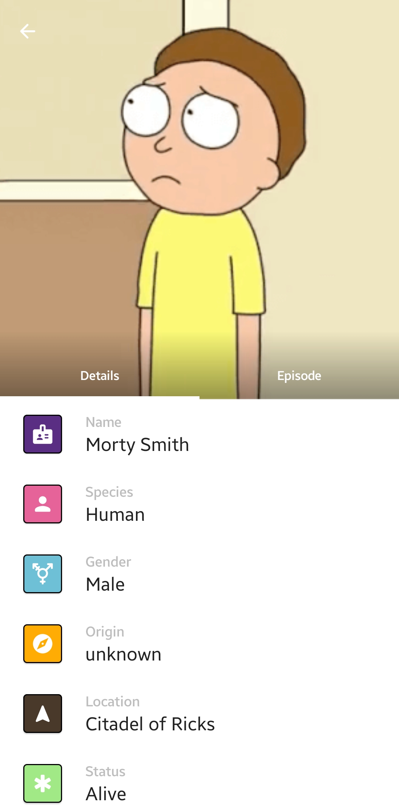

## Rick and Morty API
An app that uses ktor to fetch and display data from the Rick and Morty API

## Libraries
- JetPack Compose 
- Compose Navigation
- Coil
- Compose Accompanist
- Paging
- Ktor

## Screenshots
| Character | Details | Kotlin Sessions |
|:-----:|:-----:|:-----|
|||
